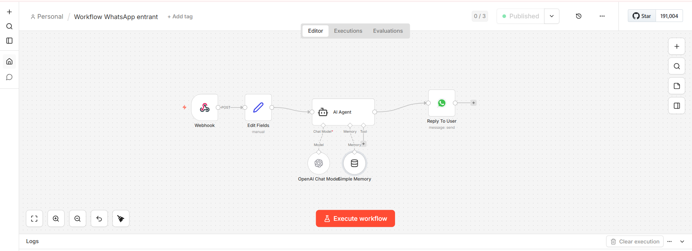

# WhatsApp Chatbot - Salon de Coiffure 💈

Chatbot WhatsApp automatisé pour un salon de coiffure, 
construit avec n8n et l'API OpenAI.

## Fonctionnalités
- Réponses automatiques aux messages WhatsApp
- Mémoire conversationnelle par client
- Intégration WhatsApp Business API

## Stack technique
- **n8n** — orchestration du workflow
- **OpenAI GPT** — moteur de réponses IA
- **WhatsApp Business API** — canal de communication
- **Simple Memory** — mémoire de session par utilisateur

## Architecture

## Démo
https://github.com/jonas-benitah/whatsapp-chatbot-coiffeur/blob/main/demo.mp4

## Prochaines étapes
- Prise de rendez-vous automatique
- Intégration Google Calendar
- Mémoire persistante (base de données)
